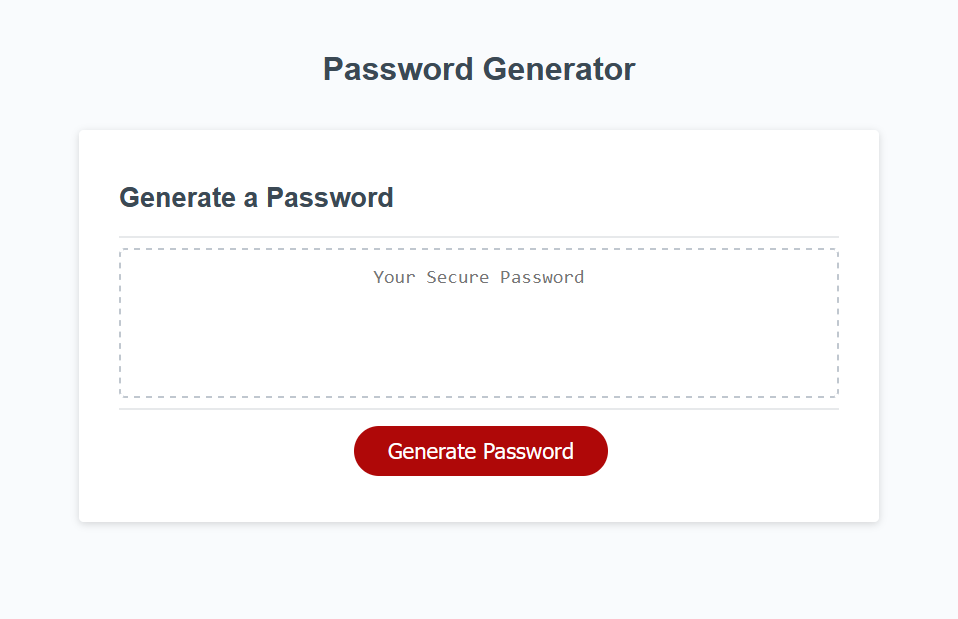

# Password Generator

Generates a new, secure password when clicking the "Generate Password" button. 

https://s-s-lee.github.io/password-generator/

## Preview

The image below is a screenshot of the Password Generator website.

## Description

### Select your password requirements

Choose from lower case letters, upper case letters, numbers, and special characters to create a secure password between 8 and 128 characters. 

## Questions or Feedback

Contact [Susan](https://github.com/s-s-lee) if there are any issues or problems with the repo.

## Licensing

This repo uses the [MIT License](https://github.com/s-s-lee/pw-generator/blob/main/LICENSE).